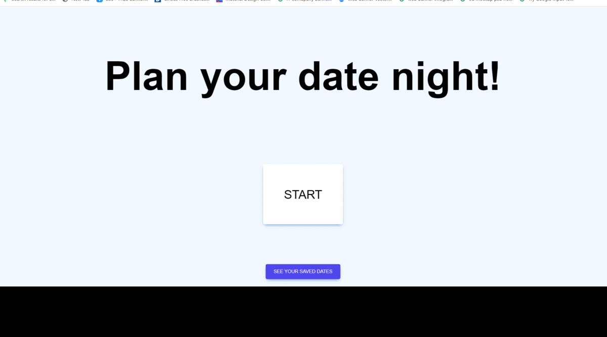
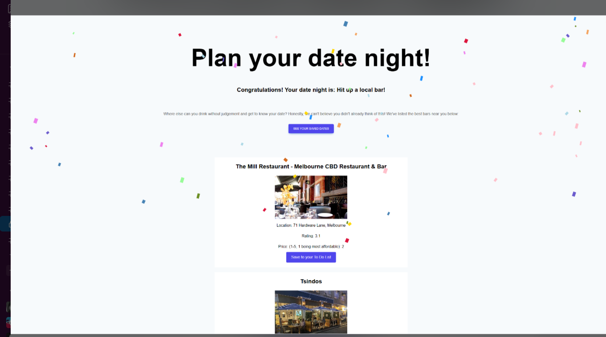
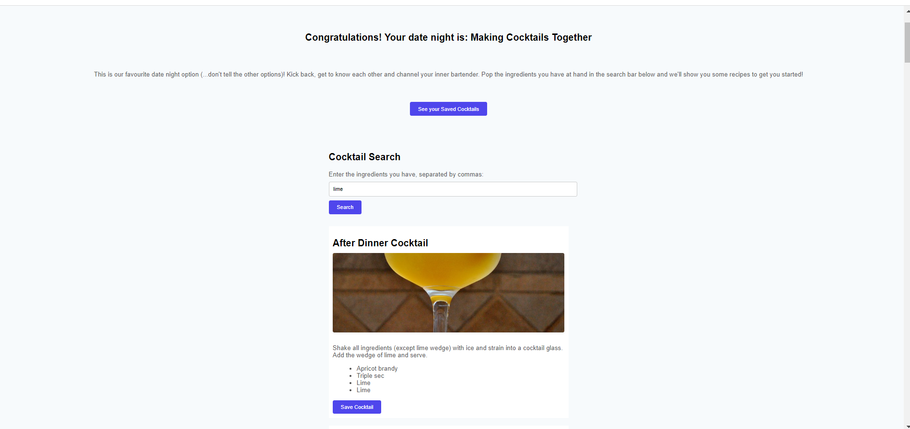
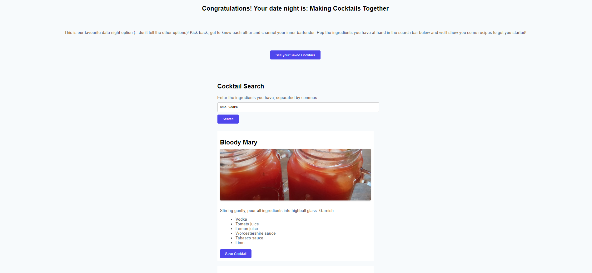
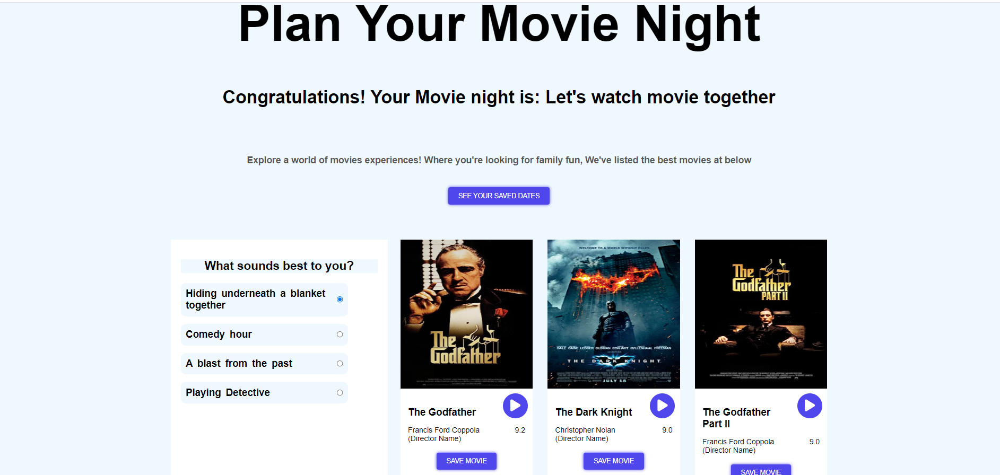
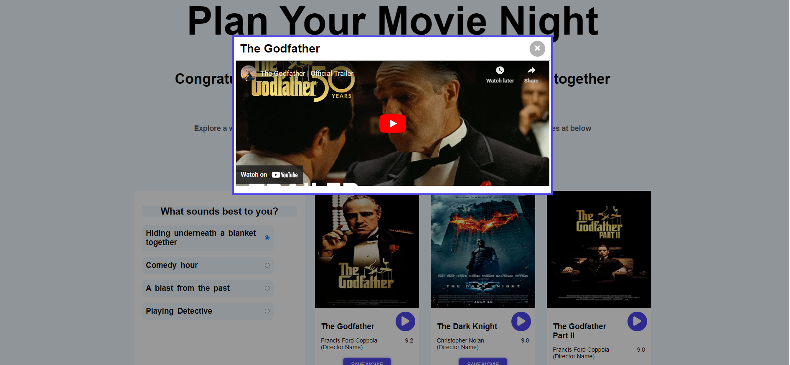
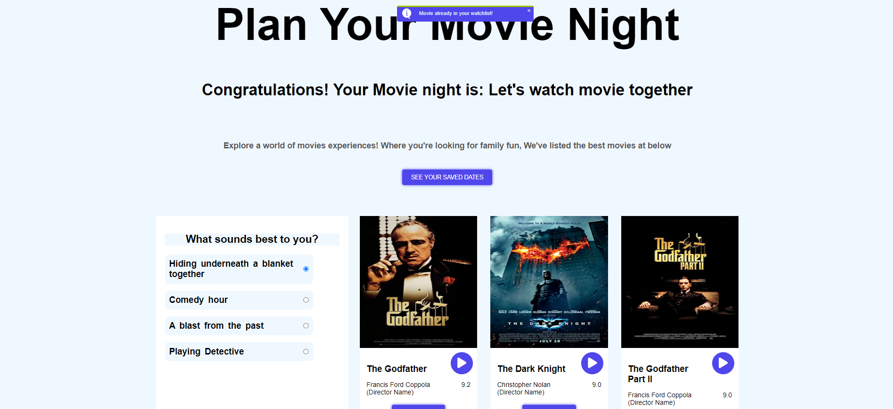
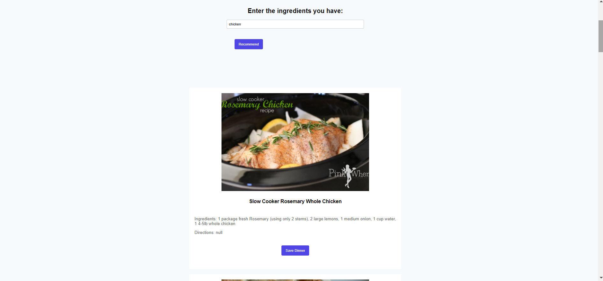
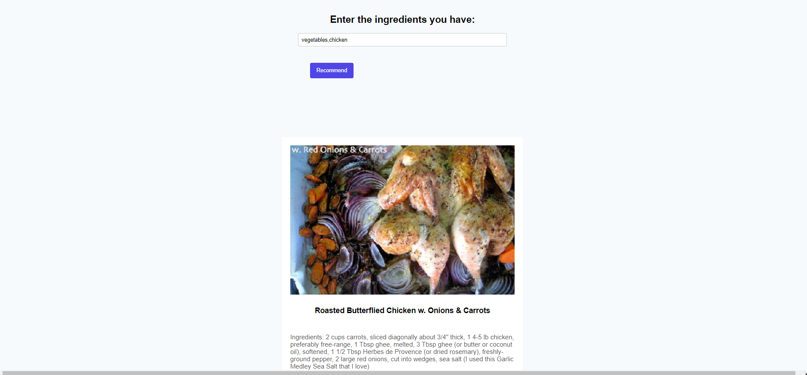
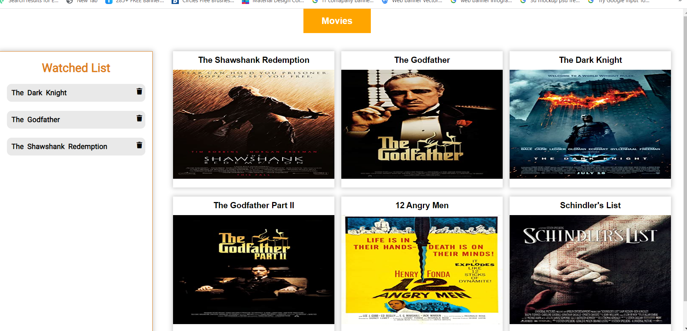

# Movie-Night-Planner

# User story 
 This is day night planner where user can explore cafe , park, adventures, movies, cocktails , dinner etc for their entertainment . When the user come to the portal ,there are two options where the can select 'Go Out' and 'Stay In'. In the Go Out Section, they can explore the places according to their taste and budget, they can go for adventures, for hang out and different places.In the Stay in section, they can find three options where they can choose between Movie Night, Cocktail Night, Dinner Night. In the Movie night, they are different categories of movies,they can decide watch Trailer. In The Cocktail Night, User can choose cocktail according to their taste and availabilty of ingredients ,they have .In the Dinner Night, User could find varieties of meals by selecting ingredients of their taste. Last but not the least is that we have provided the facilitate to the user by save their selection in the to-do-list. Upon their next visit, theu could find their previous selection.

This project has been deployed to GitHub Pages. To get this project up and running, you can follow the deployment link. Or, download the sources files to use this as a template.

* [GitHub Repository]()
* [Deployed GitHub IO]

### Prerequisites

To install this application, you will need a text editor. I recommend Visual Studio Code. 

### Installing

To install this code, download the zip file, or use GitHub's guidelines to clone the repository. 

* Demo

### This project (day night) has the following features: 

* At Adventure time
  *can get experience to go adventure places
 
* spend time with each other
   ** can enjoy and fun at resturant, parks bars etc
 

* Day time hang with friends and family members
 ** can visit differnet places and bars
 

* At Cocktail Night
    * use can serach cocktails according to thei ingredients ,they have

    *  user can search more than one ingredients to make cocktail tasty
    

* At Movie Night  
    * different categories for selecting accodring to their choice

*  click on play button ,make a wonderfull night to watch trailer 
  
   
* make their to-do-list for save their selection what ever they like

* At  Dinner Night utton 
    * use can serach meals according to their ingredients ,they have

    *  user can search more than one ingredients to make meals yummy
    

* make their to-do-list for save their selection by clicking save button what ever they like

*whole  Data will be stored into one place 
 ** next visit, can See history , what he/she has done it

 

    

### This project has media Queries for:

* max-width: 991px 
    * Adjusts body and container width
* max-width: 767px
    * Adjusts body and container width
    * Adjusts buttons
* max-width: 567px
    * Adjusts body and container width
    * Adjusts buttons to be centered and stacked# Movie-Night-Planner