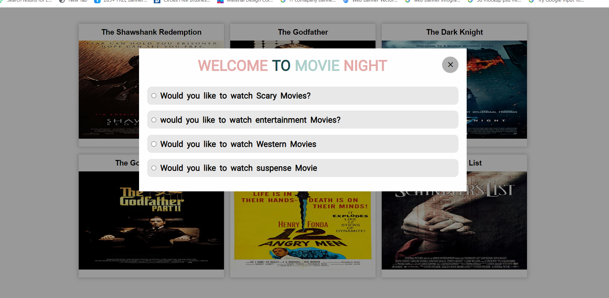
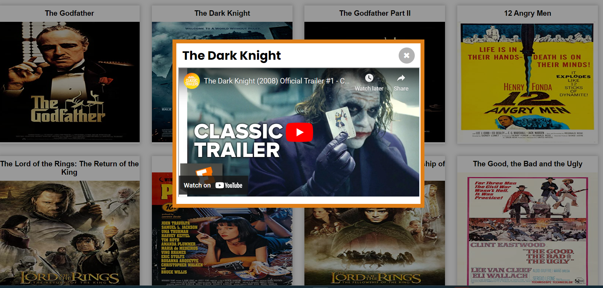
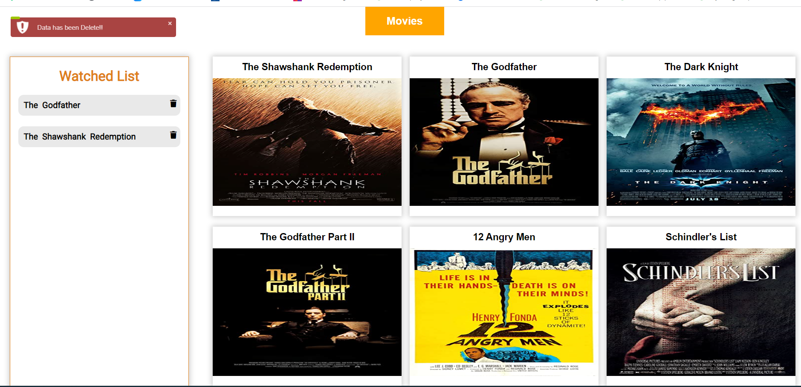

# Movie-Night-Planner

# User story 
This is a Evening Fun Night  using HTML, CSS, and Javascript. In Movie Night Planner, User can watch the movie according to their choice because i have made different categories.When he/she click on that category,can see a lot of movies . Then he/she can click on choice movie, can watch trailer , then data will be saved  and next time when he/she visit , they can see history what they watched it before .Atatched screenshot in every step at below.

This project has been deployed to GitHub Pages. To get this project up and running, you can follow the deployment link. Or, download the sources files to use this as a template.

* [GitHub Repository]()
* [Deployed GitHub IO]

### Prerequisites

To install this application, you will need a text editor. I recommend Visual Studio Code. 

### Installing

To install this code, download the zip file, or use GitHub's guidelines to clone the repository. 

* Demo

### This project (Movie Night) has the following features: 
* A Movie Night button 
    * it will show up page when user can see 'Movie' Button 

*  click on that button ,show up modal for different categories of movies
  
   

* can see a lot of movies according to  selection

* after click any movie , can watch trailer

* Data will be stored into local storage
 ** next visit, can See history , what he/she already watched

 

* Lastly In Movie planner, can delete history
  ** message will show up
  
    

### This project has media Queries for:

* max-width: 991px 
    * Adjusts body and container width
* max-width: 767px
    * Adjusts body and container width
    * Adjusts buttons
* max-width: 567px
    * Adjusts body and container width
    * Adjusts buttons to be centered and stacked# Movie-Night-Planner